# 🤖 PauloBot Store — Ecosistema Inteligente Vending & POS eCommerce

[](https://www.php.net/)
[](https://angular.dev/)
[](https://tailwindcss.com/)
[](https://swagger.io/)
[](https://frankenphp.dev/)
[](https://www.mysql.com/)

---

## 📌 Visión General de la Arquitectura

**PauloBot Store** se encuentra en un proceso continuo de **refactorización y migración arquitectónica** desde un monolito en PHP nativo hacia una arquitectura desacoplada moderna basada en **API REST (PHP 8 + FrankenPHP + Swagger/OpenAPI)** y una **Single Page Application (SPA en Angular 22 + Tailwind CSS + Vite)**.

```mermaid
graph TD
    subgraph Frontend_SPA ["⚡ Frontend SPA (Angular 22 + Tailwind CSS)"]
        StoreHome["Tienda Principal (HomeComponent)"]
        FeaturedCarousel["Carrusel de Productos Destacados"]
        InfiniteCategories["Carrusel Infinito de Categorías"]
        CartDrawer["Drawer de Carrito Reactivo"]
        Login["Login Screen (LoginComponent)"]
        AdminShell["Admin Layout (Sidebar Modular)"]
        Dashboard["Dashboard (KPIs & Gráfica 7 Días)"]
        ProductsList["Consulta Productos (ProductListComponent)"]
        ProductsForm["Agregar Producto (ProductFormComponent)"]
        CategoriesList["Categorías (CategoryListComponent)"]
        SubcategoriesList["Subcategorías (SubcategoryListComponent)"]
        MovementsList["Movimientos (MovementListComponent)"]
        CashRegister["Cortes de Caja (CashRegisterComponent)"]
        CompanyConfig["Configuración Empresa (CompanyConfigComponent)"]
        UserList["Gestión de Usuarios (UserListComponent)"]
        CartSvc["CartService (Signals & Storage)"]
        ProdSvc["ProductService (Signals)"]
        CatSvc["CategoryService (Signals)"]
        OpenApiGen["Servicios Generados (ng-openapi-gen)"]
    end

    subgraph Backend_REST ["🔙 Backend REST API (PHP 8 + FrankenPHP)"]
        Router["Router REST & CORS"]
        ProductController["ProductController (/api/v1/products/featured, /api/v1/products/*)"]
        CategoryController["CategoryController (/api/v1/categories/*)"]
        AuthController["AuthController (/api/v1/auth/*)"]
        DashboardController["DashboardController (/api/v1/dashboard)"]
        MovementController["MovementController (/api/v1/movements/*)"]
        CashRegisterController["CashRegisterController (/api/v1/cash-register/*)"]
        ConfigController["ConfigController (/api/v1/config/*)"]
        UserController["UserController (/api/v1/users/*)"]
        Database["Database Dual (Local / Nube Fallback)"]
    end

    StoreHome --> FeaturedCarousel
    StoreHome --> InfiniteCategories
    StoreHome --> CartDrawer
    StoreHome --> CartSvc
    StoreHome --> ProdSvc
    StoreHome --> CatSvc
    ProdSvc --> OpenApiGen
    CatSvc --> OpenApiGen
    OpenApiGen -->|JSON / HTTP| Router
    Router --> ProductController
    Router --> CategoryController
    ProductController --> Database
    CategoryController --> Database
```



---

## 🚀 Módulos Migrados

### 🏪 1. Storefront / Tienda Pública (`frontend/src/app/pages/store/`) y Portal de Inicio (`/`)
- **Portal de Bienvenida:** [`HomeComponent`](file:///home/paulobot/PauloBotStore/frontend/src/app/pages/home/home.component.ts) en `/`
  - Tarjetas interactivas de bienvenida y selección de acceso directo a **Tienda / Clientes** (`/store`) y **Panel Administrador** (`/login`).
- **Tienda Pública & Máquina Vending:** [`StoreComponent`](file:///home/paulobot/PauloBotStore/frontend/src/app/pages/store/store.component.ts) en `/store`
  - **Header Comercial:** Logo estilizado, buscador rápido, contador reactivo de carrito y acceso al portal / admin.
  - **Hero Banner:** Bienvenida interactiva con distintivo de autoservicio 24/7.
  - **Carrusel de Productos Destacados:** Auto-slide fluido y natural con cadencia periódica, pausa inteligente en hover/touch, badges de descuento y stock.
  - **Carrusel Infinito de Categorías:** Desplazamiento circular suave e infinito con carga ligera de imágenes cacheadas en HTTP.
  - **Drawer Lateral de Carrito:** Control interactivo de cantidades, subtotal en tiempo real y persistencia local (`CartService`).

### 🔙 2. Backend REST API (`backend/`)
- **Cero HTML:** Todo endpoint responde exclusivamente en `application/json` con cabeceras CORS unificadas.
- **Swagger / OpenAPI 3.0 Integrado:** Atributos nativos PHP 8 (`#[OA\Post]`, `#[OA\Get]`, `#[OA\Put]`, `#[OA\Delete]`, `#[OA\Patch]`).
  - Documentación interactiva en [`/api/docs`](http://localhost:8000/api/docs) con **Swagger UI**.
  - Esquema dinámico en [`/api/v1/openapi.json`](http://localhost:8000/api/v1/openapi.json).
- **Módulo de Productos & Destacados:** `GET /api/v1/products/featured`, catálogo general, servidor de imágenes con caché HTTP de 24 horas y altas multipart.
- **Módulo de Categorías y Subcategorías:** `GET /api/v1/categories` con soporte para imágenes y agrupamiento de subcategorías.
- **Módulos de Gestión:** Autenticación, Dashboard en tiempo real, Movimientos y tickets, Cortes de Caja, Configuración de Empresa y Usuarios.

---

## ⚙️ Cómo Ejecutar el Proyecto

### 1. Iniciar Backend REST API (Puerto 8000)
```bash
cd PauloBotStore
./frankenphp php-server --listen 0.0.0.0:8000 --root ./backend/public
```
- **Swagger UI:** [`http://localhost:8000/api/docs`](http://localhost:8000/api/docs)
- **OpenAPI JSON:** [`http://localhost:8000/api/v1/openapi.json`](http://localhost:8000/api/v1/openapi.json)

### 2. Iniciar Frontend SPA (Puerto 4200)
```bash
cd PauloBotStore/frontend
npm start
```
- 🌐 **Portal de Inicio:** [`http://localhost:4200/`](http://localhost:4200/)
- 🏪 **Tienda & Vending Storefront:** [`http://localhost:4200/store`](http://localhost:4200/store)
- 📊 **Dashboard Admin:** [`http://localhost:4200/admin`](http://localhost:4200/admin)
- 👥 **Gestión de Usuarios:** [`http://localhost:4200/admin/usuarios`](http://localhost:4200/admin/usuarios)
- ⚙️ **Configuración Empresa:** [`http://localhost:4200/admin/configuracion`](http://localhost:4200/admin/configuracion)
- 🏧 **Cortes de Caja:** [`http://localhost:4200/admin/cortes-caja`](http://localhost:4200/admin/cortes-caja)
- 💸 **Consulta de Movimientos:** [`http://localhost:4200/admin/movimientos`](http://localhost:4200/admin/movimientos)
- 📋 **Consulta de Productos:** [`http://localhost:4200/admin/productos`](http://localhost:4200/admin/productos)
- ➕ **Agregar Producto:** [`http://localhost:4200/admin/productos/nuevo`](http://localhost:4200/admin/productos/nuevo)
- 🏷️ **Categorías:** [`http://localhost:4200/admin/categorias`](http://localhost:4200/admin/categorias)
- 🗂️ **Subcategorías:** [`http://localhost:4200/admin/subcategorias`](http://localhost:4200/admin/subcategorias)

### 3. Regenerar Servicios e Interfaces de TypeScript
```bash
cd PauloBotStore/frontend
npm run api:generate
```
