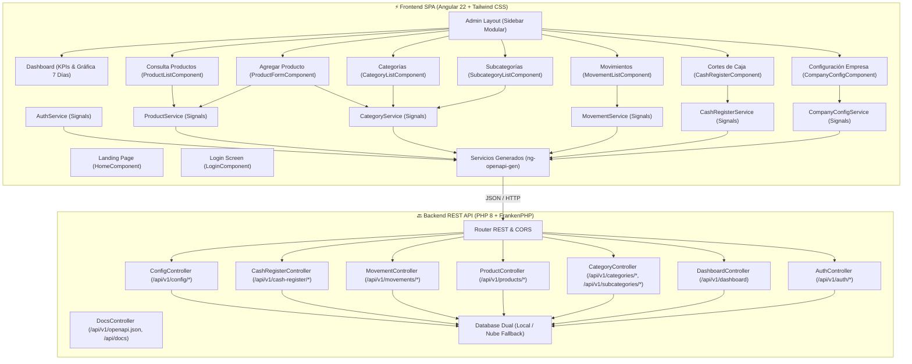

# 🤖 PauloBot Store — Ecosistema Inteligente Vending & POS eCommerce

[](https://www.php.net/)
[](https://angular.dev/)
[](https://tailwindcss.com/)
[](https://swagger.io/)
[](https://frankenphp.dev/)
[](https://www.mysql.com/)

---

## 📌 Visión General de la Arquitectura

**PauloBot Store** se encuentra en un proceso continuo de **refactorización y migración arquitectónica** desde un monolito en PHP nativo hacia una arquitectura desacoplada moderna basada en **API REST (PHP 8 + FrankenPHP + Swagger/OpenAPI)** y una **Single Page Application (SPA en Angular 22 + Tailwind CSS + Vite)**.



---

## 🚀 Módulos Migrados

### 🔙 1. Backend REST API (`backend/`)
- **Cero HTML:** Todo endpoint responde exclusivamente en `application/json` con cabeceras CORS unificadas.
- **Swagger / OpenAPI 3.0 Integrado:** Atributos nativos PHP 8 (`#[OA\Post]`, `#[OA\Get]`, `#[OA\Put]`, `#[OA\Delete]`, `#[OA\Patch]`).
  - Documentación interactiva en [`/api/docs`](http://localhost:8000/api/docs) con **Swagger UI**.
  - Esquema dinámico en [`/api/v1/openapi.json`](http://localhost:8000/api/v1/openapi.json).
- **Módulo de Autenticación:** `login`, `register`, `me`, `logout` con verificación multi-hash (BCrypt + MD5 upgrade).
- **Módulo de Dashboard:** KPIs en tiempo real (Ventas Hoy, Ventas Mes, Inventario, Stock Bajo, Gráfica 7 días, Top Ventas).
- **Módulo de Productos:** Catálogo completo, altas con imágenes optimizadas, detalle, servidor de imágenes con caché HTTP de 24 horas y eliminación.
- **Módulo de Categorías y Subcategorías:** CRUD completo de categorías y subcategorías, asignaciones relacionales y consultas planas.
- **Módulo de Movimientos / Finanzas:** Historial cronológico de ventas, desglose de tickets, KPIs financieros y filtros por método de cobro.
- **Módulo de Cortes de Caja (Cash Register):** Control de turno activo, apertura de jornada, arqueo de cierre, movimientos manuales e historial.
- **Módulo de Configuración de Empresa:**
  - `GET /api/v1/config/company`: Obtener datos comerciales, fiscales y formato de ticket.
  - `PUT /api/v1/config/company`: Guardar y actualizar los datos corporativos de la empresa.

### ⚡ 2. Frontend SPA (`frontend/`)
- **Stack Moderno:** Angular 22 Standalone Components, Signals (`signal`, `computed`), Formularios Reactivos y Tailwind CSS v4.
- **Generación Automática:** Cliente TypeScript generado con `ng-openapi-gen` desde la API.
- **Vistas Disponibles:**
  - 🏠 **Landing Page:** [`HomeComponent`](file:///home/paulobot/PauloBotStore/frontend/src/app/pages/home/home.component.ts)
  - 🔐 **Login Administrador:** [`LoginComponent`](file:///home/paulobot/PauloBotStore/frontend/src/app/pages/login/login.component.ts)
  - 📊 **Dashboard:** [`DashboardComponent`](file:///home/paulobot/PauloBotStore/frontend/src/app/pages/dashboard/dashboard.component.ts)
  - 📋 **Consulta de Productos:** [`ProductListComponent`](file:///home/paulobot/PauloBotStore/frontend/src/app/pages/products/product-list/product-list.component.ts)
  - ➕ **Agregar Producto:** [`ProductFormComponent`](file:///home/paulobot/PauloBotStore/frontend/src/app/pages/products/product-form/product-form.component.ts)
  - 🏷️ **Gestión de Categorías:** [`CategoryListComponent`](file:///home/paulobot/PauloBotStore/frontend/src/app/pages/categories/category-list/category-list.component.ts)
  - 🗂️ **Gestión de Subcategorías:** [`SubcategoryListComponent`](file:///home/paulobot/PauloBotStore/frontend/src/app/pages/categories/subcategory-list/subcategory-list.component.ts)
  - 💸 **Consulta de Movimientos:** [`MovementListComponent`](file:///home/paulobot/PauloBotStore/frontend/src/app/pages/movements/movement-list/movement-list.component.ts)
  - 🏧 **Cortes de Caja:** [`CashRegisterComponent`](file:///home/paulobot/PauloBotStore/frontend/src/app/pages/cash-register/cash-register.component.ts)
  - ⚙️ **Configuración de Empresa:** [`CompanyConfigComponent`](file:///home/paulobot/PauloBotStore/frontend/src/app/pages/config/company-config/company-config.component.ts) (con Live Preview de ticket térmico)

---

## ⚙️ Cómo Ejecutar el Proyecto

### 1. Iniciar Backend REST API (Puerto 8000)
```bash
cd PauloBotStore
./frankenphp php-server --listen 0.0.0.0:8000 --root ./backend/public
```
- **Swagger UI:** [`http://localhost:8000/api/docs`](http://localhost:8000/api/docs)
- **OpenAPI JSON:** [`http://localhost:8000/api/v1/openapi.json`](http://localhost:8000/api/v1/openapi.json)

### 2. Iniciar Frontend SPA (Puerto 4200)
```bash
cd PauloBotStore/frontend
npm start
```
- **SPA General:** [`http://localhost:4200/`](http://localhost:4200/)
- **Dashboard:** [`http://localhost:4200/admin`](http://localhost:4200/admin)
- **Configuración Empresa:** [`http://localhost:4200/admin/configuracion`](http://localhost:4200/admin/configuracion)
- **Cortes de Caja:** [`http://localhost:4200/admin/cortes-caja`](http://localhost:4200/admin/cortes-caja)
- **Movimientos:** [`http://localhost:4200/admin/movimientos`](http://localhost:4200/admin/movimientos)
- **Consulta Productos:** [`http://localhost:4200/admin/productos`](http://localhost:4200/admin/productos)
- **Agregar Producto:** [`http://localhost:4200/admin/productos/nuevo`](http://localhost:4200/admin/productos/nuevo)
- **Categorías:** [`http://localhost:4200/admin/categorias`](http://localhost:4200/admin/categorias)
- **Subcategorías:** [`http://localhost:4200/admin/subcategorias`](http://localhost:4200/admin/subcategorias)

### 3. Regenerar Servicios e Interfaces de TypeScript
```bash
cd PauloBotStore/frontend
npm run api:generate
```
