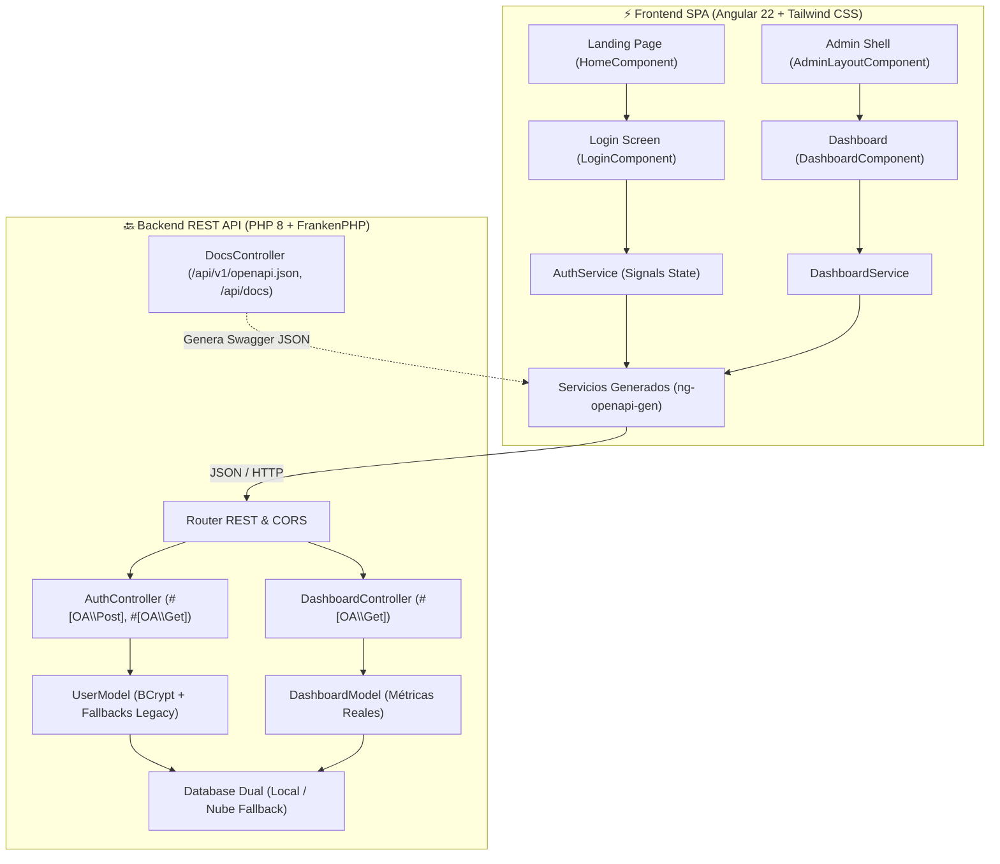

# 🤖 PauloBot Store — Ecosistema Inteligente Vending & POS eCommerce

[](https://www.php.net/)
[](https://angular.dev/)
[](https://tailwindcss.com/)
[](https://swagger.io/)
[](https://frankenphp.dev/)
[](https://www.mysql.com/)

---

## 📌 Visión General de la Arquitectura

**PauloBot Store** se encuentra en un proceso de **refactorización y migración arquitectónica** desde un monolito en PHP nativo hacia una arquitectura desacoplada y moderna basada en **API REST (PHP 8 + FrankenPHP + Swagger/OpenAPI)** y una **Single Page Application (SPA en Angular + Tailwind CSS + Vite)**.



---

## 🚀 Lo que se implementó en esta fase

### 🔙 1. Backend REST API (`backend/`)
- **Cero HTML:** Todo controlador y endpoint responde exclusivamente en formato `application/json` con cabeceras CORS unificadas.
- **Swagger / OpenAPI 3.0 Integrado:**
  - Uso de atributos nativos PHP 8 (`#[OA\Info]`, `#[OA\Post]`, `#[OA\Get]`, `#[OA\Schema]`).
  - DTOs fuertemente tipados (`LoginRequest`, `LoginResponse`, `DashboardMetricsDto`, `SalesMetricsDto`, `InventoryMetricsDto`, `ChartDto`, `TopProductDto`, `RecentSaleDto`).
  - Documentación interactiva en [`/api/docs`](http://localhost:8000/api/docs) con **Swagger UI**.
  - Esquema dinámico en [`/api/v1/openapi.json`](http://localhost:8000/api/v1/openapi.json).
- **Módulo de Autenticación:**
  - `POST /api/v1/auth/login`: Validación de credenciales con hashing multi-algoritmo (BCrypt con actualización progresiva de hashes MD5/texto plano antiguos).
  - `POST /api/v1/auth/register`: Registro seguro de nuevos usuarios.
  - `GET /api/v1/auth/me`: Consulta de la sesión activa del usuario.
  - `POST /api/v1/auth/logout`: Invalidation de sesión.
- **Módulo de Dashboard:**
  - `GET /api/v1/dashboard`: Retorna ventas de hoy, ventas del mes, inventario en stock, alertas de stock crítico ($\le 5$), histórico de 7 días y top de ventas.
- **Base de Datos Resiliente:** Manejo de conexión dual con fallback automático y silencioso hacia la base de datos remota (`cpanel.colegos.com.mx`).

### ⚡ 2. Frontend SPA (`frontend/`)
- **Stack Moderno:** Angular Standalone Components, TypeScript estricto, Angular Signals (`signal`, `computed`) y Tailwind CSS v4.
- **Generación de Clientes con `ng-openapi-gen`:** Autogeneración de interfaces y servicios de TypeScript consumiendo el `openapi.json` del backend.
- **Landing Page ([`HomeComponent`](file:///home/paulobot/PauloBotStore/frontend/src/app/pages/home/home.component.ts)):** Migración de la portada con navbar glassmorphism, accesos rápidos, grid de portales y capacidades del sistema.
- **Pantalla de Login ([`LoginComponent`](file:///home/paulobot/PauloBotStore/frontend/src/app/pages/login/login.component.ts)):** Formulario reactivo con validaciones estrictas, toggles de visibilidad de contraseña, alertas dinámicas y redirección inmediata a administración.
- **Layout Modular de Administración ([`AdminLayoutComponent`](file:///home/paulobot/PauloBotStore/frontend/src/app/layout/admin-layout/admin-layout.component.ts)):** Sidebar responsivo con enlaces de navegación, perfil de usuario logueado, botón de logout e indicador de estado del sistema.
- **Dashboard Principal ([`DashboardComponent`](file:///home/paulobot/PauloBotStore/frontend/src/app/pages/dashboard/dashboard.component.ts)):** KPIs de ventas en tiempo real, gráfica interactiva de tendencia de 7 días, tabla de Top 5 productos más vendidos y tabla de últimas transacciones.
- **Guards de Ruta:** `authGuard` (protege `/admin` redirigiendo a `/login`) y `guestGuard` (previene ver login si ya se está autenticado).

---

## 🏗️ Estructura del Proyecto

```text
PauloBotStore/
├── backend/                      # 🔙 API REST (PHP + FrankenPHP)
│   ├── public/
│   │   ├── index.php             # Entrypoint y Router REST
│   │   └── openapi.json          # Especificación OpenAPI 3.0 exportada
│   ├── src/
│   │   ├── Core/                 # Database, Response (JSON/CORS), Router
│   │   ├── Controllers/          # AuthController, DashboardController, DocsController
│   │   ├── Models/               # User, Dashboard
│   │   ├── DTOs/                 # LoginRequest, DashboardMetricsDto, etc.
│   │   └── OpenApi.php           # Configuración raíz de Swagger
│   ├── Caddyfile                 # Configuración de FrankenPHP / Caddy
│   └── composer.json             # Dependencias (zircote/swagger-php)
│
├── frontend/                     # ⚡ SPA FRONTEND (Angular + Tailwind)
│   ├── src/app/
│   │   ├── api/                  # Código autogenerado por ng-openapi-gen
│   │   ├── core/
│   │   │   ├── guards/           # auth.guard.ts, guest.guard.ts
│   │   │   └── services/         # auth.service.ts, dashboard.service.ts
│   │   ├── layout/
│   │   │   └── admin-layout/     # AdminLayoutComponent (Sidebar + Header)
│   │   └── pages/
│   │       ├── home/             # HomeComponent (Landing Page)
│   │       ├── login/            # LoginComponent (Login reactivo)
│   │       └── dashboard/        # DashboardComponent (Métricas & KPIs)
│   ├── proxy.conf.json           # Proxy de desarrollo para /api -> :8000
│   └── package.json
│
├── admin/                        # 🏛️ Monolito Legacy (Admin)
├── store/                        # 🏛️ Monolito Legacy (Tienda)
├── .env.example                  # Plantilla de variables de entorno
└── compose.yaml                  # Orquestación de contenedores
```

---

## ⚙️ Cómo Ejecutar el Proyecto

### 1. Variables de Entorno
Copia la plantilla `.env.example` en la raíz del proyecto y en el backend:
```bash
cp .env.example .env
cp .env.example backend/.env
```

### 2. Iniciar el Backend REST API (Puerto 8000)
```bash
cd PauloBotStore
./frankenphp php-server --listen 0.0.0.0:8000 --root ./backend/public
```
- **Swagger UI interactivo:** [`http://localhost:8000/api/docs`](http://localhost:8000/api/docs)
- **OpenAPI JSON:** [`http://localhost:8000/api/v1/openapi.json`](http://localhost:8000/api/v1/openapi.json)

### 3. Iniciar el Frontend SPA (Puerto 4200)
```bash
cd PauloBotStore/frontend
npm start
```
- **Aplicación Angular:** [`http://localhost:4200/`](http://localhost:4200/)
- **Login:** [`http://localhost:4200/login`](http://localhost:4200/login)
- **Dashboard Administrador:** [`http://localhost:4200/admin`](http://localhost:4200/admin)

### 4. Regenerar Servicios e Interfaces de TypeScript
Cada vez que agregues o modifiques atributos Swagger en el backend:
```bash
cd PauloBotStore/frontend
npm run api:generate
```

### 5. Monolito PHP Legacy (Opcional - Puerto 8080)
Para comparar o consultar módulos legacy en desarrollo:
```bash
cd PauloBotStore
./frankenphp php-server --listen 0.0.0.0:8080 --root .
```
- **Monolito Legacy:** [`http://localhost:8080/admin/login.php`](http://localhost:8080/admin/login.php)
